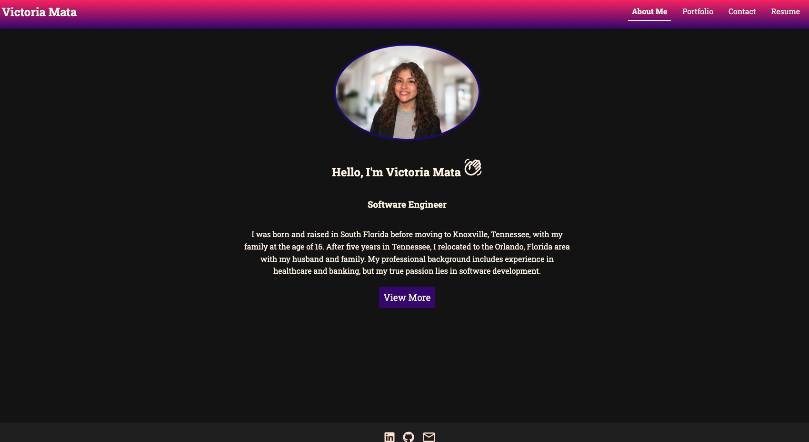

# React Portfolio
   ## Description:
   This deployed application was built using React, Typescript, and CSS. The user can view this website using laptops, computers, Ipads, tablets, and phones. As a software development student, I wanted to create this app to showcase to potentially future employers my skills I have learned from the coding bootcamp. This user-friendly application allows you to easily and clearly navigate through tabs, so that you can get to know me, view my recent projects, contact me, and download my resume.
   ## Table of Contents:
   * [Installation](#installation)
   * [Usage](#usage)
   * [License](#license)
   * [Contributing](#contributing)
   * [Tests](#tests)
   * [Questions](#questions)
   ## Installation:
   After cloning this repository, run the command in your terminal "npm i " to install the dependencies that are in the package.json file. Run in the command line "npm run start" to begin working with the application.
   ## Usage:
   Viewing the header, you can navigate between the tabs labeled " About Me, Portfolio, Contact, and Resume". The About Me page is what appears when the app starts running, or if the link is clicked on. On the Portfolio page, you will see project card componenets that showcase previous projects with two links- one to the deployed site, and another link to the Github repository. On the contact page, you can submit a form if you input your name, email, and a message, otherwise a box appears asking to please fill out the form. On the Resume page, I included icons that are related to the skills I have learned. There is also a box containing a downloadable resume when clicked. Finally, the footer contains icons that will redirect the user to my LinkedIn, Github, and Twitter(X) accounts.

   Here is the link to the deployed application:
https://victoriamata.netlify.app/
   
   

   ## License: 
   
   [Click to read more!](https://opensource.org/licenses/MIT)
   ## Contributing: 
   * Create a feature branch using "git checkout -b *branchname*" in your terminal. 
   * After making your changes, type in the command "git commit -m "*detailed message on added features*".
   * Push changes to your feature branch using "git push origin *branchname*". 
   * Finally, create a pull request on Github for those changes to be merged. 

Contributions are appreciated😊!
   ## Tests:
   N/A
   ## Questions:
   * Github: [Link to profile](https://github.com/victoriamata)
   * Email: victoriamataxo@gmail.com